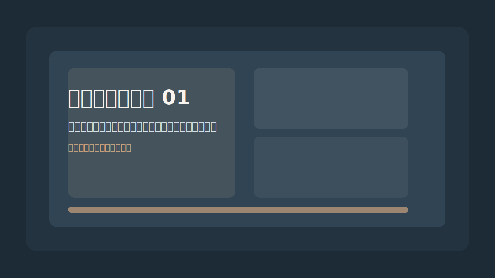
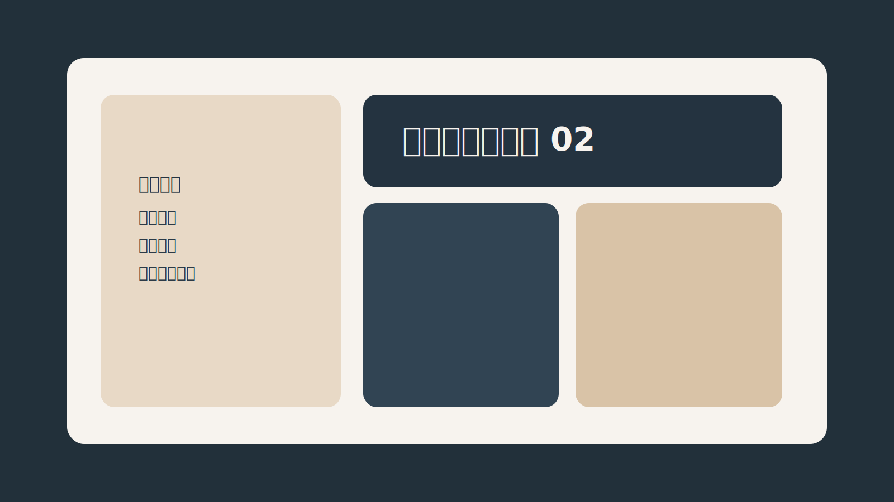
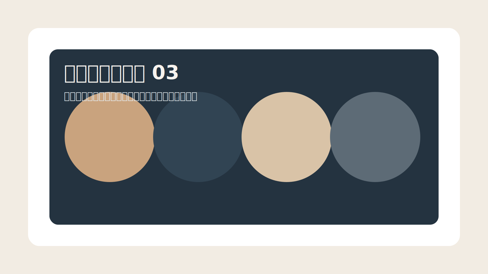
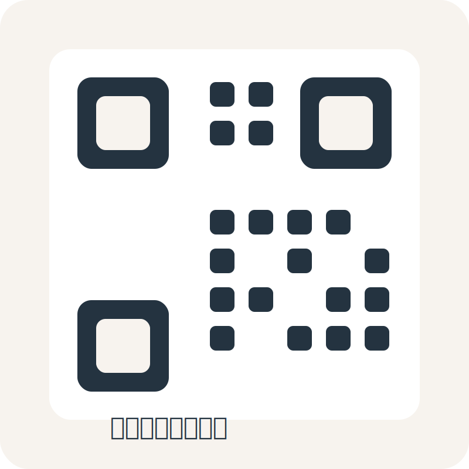

# 江苏品鹤装饰材料有限公司官网

这是一个适合新手维护的静态企业官网项目，使用最基础的 `HTML + CSS + JavaScript` 编写，不依赖后端、数据库或登录系统。你可以直接双击 `index.html` 在浏览器里预览，也可以用 VS Code 等编辑器慢慢修改。

## 项目文件说明

- `index.html`
  网站主页面。页面上的文字内容、模块结构、图片位置、联系电话、地址、员工职位结构、轮播说明文字都主要在这里修改。

- `styles.css`
  网站样式文件。控制配色、排版、按钮、卡片、组织结构图、轮播视觉效果、手机端适配和滚动动画。

- `script.js`
  网站交互文件。控制手机端导航开关、风貌轮播、缩略按钮切换、进度条动画、返回顶部按钮、演示表单提示等。

- `assets/`
  存放网站图片资源。目前里面是占位图，后续你可以替换成公司真实照片、企业微信二维码等。

## 如何本地预览

### 方法 1：最简单

1. 打开项目文件夹。
2. 找到 `index.html`。
3. 用浏览器双击打开即可预览。

### 方法 2：用编辑器预览

1. 用 VS Code 打开整个项目文件夹。
2. 打开 `index.html`。
3. 如果你安装了 Live Server 插件，也可以右键选择“Open with Live Server”进行预览。

## 后续最常改的内容在哪里

### 1. 修改公司电话

打开 `index.html`，搜索以下关键词：

- `联系电话`
- `待补充`

你会看到页面里有几处电话占位内容，建议把这些位置一起改掉：

- Hero 区域的企业信息速览
- 联系我们区域
- 页脚区域

例如把：

```html
<strong>待补充</strong>
```

改成：

```html
<strong>13800000000</strong>
```

## 2. 替换公司图片

当前演示图片在 `assets/` 文件夹中：

- `assets/showcase-1.svg`
- `assets/showcase-2.svg`
- `assets/showcase-3.svg`

你有两种替换方法：

### 方法 A：最适合新手

直接保留原文件名，把自己的图片改成相同文件名后替换原文件。

### 方法 B：用自己的文件名

例如你放入：

- `assets/gongsi-1.jpg`
- `assets/gongsi-2.jpg`
- `assets/gongsi-3.jpg`

那么你还要打开 `index.html`，找到这几段图片代码，把路径改掉：

```html



```

### 风貌轮播的标题和说明在哪里改

轮播里每一张图都长这样：

```html
<figure class="slide" data-title="标题" data-desc="说明文字">
  
  <figcaption>
    <strong>标题</strong>
    <p>说明文字</p>
  </figcaption>
</figure>
```

如果你替换成真实公司照片，建议把 `data-title`、`data-desc`、`<strong>`、`<p>` 这些文字也一起改掉，这样右侧说明区和图片下方说明会同步更自然。

### 微信二维码替换位置

二维码图片在：

- `assets/wechat-qr-placeholder.svg`

如果你有真实二维码，也可以直接替换这个文件，或者改 `index.html` 里的这一行：

```html

```

## 3. 修改员工职位和人数

打开 `index.html`，找到 `员工职位构成` 这一部分。

现在每个职位卡片都改成了这种结构：

```html
<article class="team-node" data-count="人数待补充">
  <span class="team-node-label">业务协同</span>
  <h3>销售部</h3>
  <p>负责客户开发、业务洽谈、合作跟进与需求对接。</p>
  <strong>人数待补充</strong>
</article>
```

如果你想改成真实人数，比如销售部 5 人，可以改成：

```html
<article class="team-node" data-count="5 人">
  <span class="team-node-label">业务协同</span>
  <h3>销售部</h3>
  <p>负责客户开发、业务洽谈、合作跟进与需求对接。</p>
  <strong>5 人</strong>
</article>
```

说明：

- `data-count="5 人"` 是卡片右上角的小标签
- `<strong>5 人</strong>` 是卡片底部的人数显示
- `<span class="team-node-label">业务协同</span>` 是卡片上方的小分类标签
- `<h3>` 是职位名称
- `<p>` 是该职位说明

## 4. 修改网站文案

页面大部分文案都在 `index.html` 中，直接改中文内容即可。建议优先关注这些区域：

- Hero 首屏
- 公司简介
- 主营产品 / 服务
- 为什么选择我们
- 公司风貌轮播说明
- 员工职位构成
- 联系我们
- 页脚

如果只是改文字，一般不用动 `styles.css` 和 `script.js`。

## 5. 修改颜色和样式

如果以后想改网站颜色，先打开 `styles.css` 最上面的这部分变量：

```css
:root {
  --color-bg: #f3efe8;
  --color-primary: #9e7752;
  --color-surface-dark: #243340;
}
```

这里是整站最核心的颜色设置。改这些变量，网站大部分配色会一起变化。

## 新手修改建议

- 先改 `index.html` 里的文字和电话。
- 再替换 `assets/` 里的图片。
- 然后修改风貌轮播里的标题和说明。
- 如果有真实员工人数，再改 `员工职位构成` 模块里的 `data-count` 和 `<strong>`。
- 最后如果想调整颜色，再去改 `styles.css`。
- 每改完一次，刷新浏览器看效果。
- 如果改错了，可以按 `Ctrl + Z` 撤销。

## 当前项目特点

- 响应式布局，支持电脑和手机浏览
- 顶部固定导航
- 更正式的企业官网视觉风格
- 首页层次和留白已优化
- 公司风貌高级轮播图
- 更直观的员工组织结构展示
- 返回顶部按钮
- 基础 SEO 信息已添加
- 所有未提供信息都用“待补充”标注，方便后续继续完善
